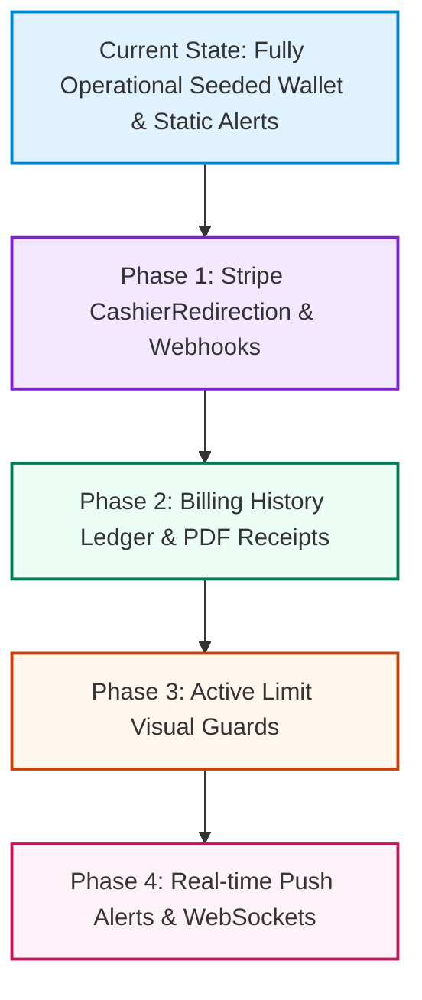

# Sellio Platform - Future Roadmap & Next Steps

This document outlines the high-fidelity expansion routes for Sellio's subscription billing (memberships), transactional ledger history, limit validation guards, and real-time dashboard notifications.

---

## 🗺️ Roadmap & Architectural Phases

---

## 🛠️ Phase Detail & Technical Specifications

### 1. Stripe Checkout Redirection & Dynamic Webhook Listeners 💳
*   **Goal:** Replace manual mock subscription updates with real-time checkout redirection and robust payment lifecycle sync.
*   **Backend Steps:**
    *   **Redirection Endpoint:** Add `GET /api/v1/dashboard/partner/subscriptions/checkout` generating a dynamic Stripe Checkout Session Redirection URL with metadata binding the `partner_id` and selected `plan_id`.
    *   **Stripe Webhook Handler:** Build a secure `POST /api/webhooks/stripe` routing engine validating Stripe signatures. Listen for:
        *   `checkout.session.completed`: Sets subscription status to `active` and captures gateway IDs.
        *   `invoice.payment_succeeded`: Extends subscription period.
        *   `customer.subscription.deleted`: Drops plan status back to free tier or warns partner.
*   **Frontend Steps:**
    *   Wire the "Upgrade to [Tier]" button to request a session URL and trigger `window.location.assign(sessionUrl)` for native premium credit card/Apple Pay checkout flows.

---

### 2. Subscription Billing Ledger & PDF Invoice Receipts Hub 📄
*   **Goal:** Give partners access to historical subscription payments, offering direct invoice downloads and accounting ledger lists.
*   **Backend Steps:**
    *   Expose `GET /api/v1/dashboard/partner/invoices` returning raw records from a new `invoices` table mapped to users.
    *   Expose `GET /api/v1/dashboard/partner/invoices/{id}/download` returning dynamic PDF streams constructed using the standard `barryvdh/laravel-dompdf` library.
*   **Frontend Steps:**
    *   Under [MembershipsPage.tsx](file:///d:/Sellio/apps/seller/src/pages/memberships/MembershipsPage.tsx), design an elegant, expandable "Billing Ledger" table.
    *   Render invoice records showing payment date, amount, active tier, invoice status (`Paid`, `Void`, `Refunding`), and print buttons initiating local device print sheets or PDF stream downloads.

---

### 3. Active Limit Visual Guards & Model-Level Validators 🛡️
*   **Goal:** Protect platform tier structure by locking down listing additions when partner listing counts meet active subscription capacities.
*   **Backend Steps:**
    *   Implement an abstract `ListingQuota` middleware or model-level validation rule that intercept requests to `POST /api/v1/dashboard/partner/{listing-type}` (e.g. `properties`, `autos`, `classifieds`).
    *   Compare the user's active plan listing limits (Starter: 3, Pro: 10, Enterprise: 999) with their current database row counts.
*   **Frontend Steps:**
    *   In listing creation pipelines (e.g., `AddPropertyModal`, `AddAutoModal`), precheck counts.
    *   If the partner is out of space, block inputs and display a glassmorphic blur card overlay presenting active tier quotas and an instant **"Upgrade Tier to Unlock"** shortcut.

---

### 4. Real-time Push Alerts & WebSocket Channels 🔌
*   **Goal:** Instantly display unread incoming lead inquiries, bookings, and alerts inside the dashboard sidebar and header bells without page updates.
*   **Backend Steps:**
    *   Utilize Laravel Broadcasting coupled with Pusher or a local Soketi socket server.
    *   Update `PartnerAlertNotification` to broadcast on `private-partner-channel.{id}`.
*   **Frontend Steps:**
    *   Configure Laravel Echo on the React app.
    *   Bind a listener that pops high-fidelity `toast` prompts and updates sidebar indicator numbers in real-time when new alerts are dispatched.
