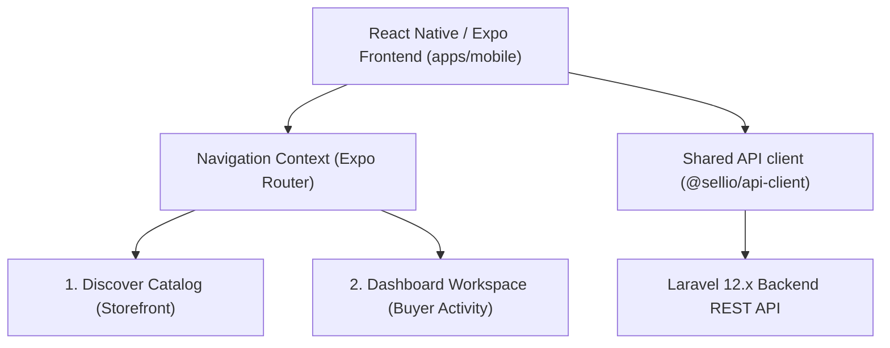

# Sellio Mobile App - Architectural Implementation Plan

> **Superseded:** This Expo/React Native plan is retained for historical context only. React Native/Expo will be removed from `apps/mobile`. Active implementation planning is in `FLUTTER_BUYER_APP_DEVELOPMENT_PLAN_2026-06-20.md`.

This document outlines the detailed architectural blueprint and phase-based plan to scale the existing React Native/Expo prototype in `apps/mobile` into a fully functional, premium cross-platform mobile application synced with the Laravel 12.x backend.

---

## 🗺️ Architecture Overview

The Sellio mobile app is built on **React Native (Expo SDK 54)**. It will consume the existing monorepo dependencies and act as a unified customer application supporting both **Storefront Discovery** and **Buyer Workspace Dashboard** capabilities in one client-side binary.



### Key Technical Specs:
*   **Engine:** Expo SDK 54+ (React Native 0.81+)
*   **Routing/Navigation:** `expo-router` (File-system based routing utilizing tab navigation)
*   **State Management:** React Context API + Expo SecureStore (for persistent tokens)
*   **Networking:** Shared Axios `@sellio/api-client` wrapper
*   **Aesthetics:** Modern, dark-mode luxury aesthetics matching the glassmorphic desktop styling (custom linear-gradients and dark cards).

---

## 💎 Phase-by-Phase Execution Plan

We will build the application in 5 sequential phases:

### Phase 1: Navigation & Routing Shell
*   **Objective:** Install navigation dependencies and build the tab routing layout.
*   **Tasks:**
    - [x] Install Expo Navigation: `npx expo install expo-router react-native-safe-area-context react-native-screens`
    - [x] Setup File-based routes under `apps/mobile/app/`:
        - `(tabs)/_layout.tsx`: Configures bottom tab navigator (Home, Favorites, Messages, Settings).
        - `(tabs)/index.tsx`: Homepage listing grid (Storefront vertical selectors).
        - `(tabs)/favorites.tsx`: Bookmarked items.
        - `(tabs)/messages.tsx`: Chat and inbox lists.
        - `(tabs)/settings.tsx`: Profile identity and theme.
        - `listing/[slug].tsx`: Dynamic details modal screen for full listing audits.
        - `login.tsx`: Auth guard panel.

### Phase 2: Token Auth & Secure Store Setup
*   **Objective:** Connect authentication to Laravel Sanctum.
*   **Tasks:**
    - [ ] Install Expo SecureStore: `npx expo install expo-secure-store`
    - [ ] Design Auth Context (`AuthContext.tsx`):
        - Handle `login(email, password)` calling `POST /api/v1/auth/login`.
        - Persist Sanctum bearer tokens securely in `SecureStore`.
        - Inject tokens into all outgoing Axios requests.
    - [ ] Build high-fidelity login interface with glassmorphic cards and validation error alerts.

### Phase 3: Dynamic Storefront Discovery Grid
*   **Objective:** Replicate storefront listing feeds.
*   **Tasks:**
    - [ ] Wire dynamic horizontal scroll components for **Vertical Badges** (Properties, Autos, Events, Services, Jobs, Classifieds, Products).
    - [ ] Build dynamic listing grids using `FlatList` with pull-to-refresh mechanics.
    - [ ] Wire detail view screens (`listing/[slug].tsx`):
        - Render Spatie main image gallery sliders.
        - Display structured location tags (integrating native maps or static map widgets).
        - Integrate direct checkout triggers or direct buyer messaging hooks.

### Phase 4: Buyer Dashboard & Conversations
*   **Objective:** Port the Vite `buyer` panel features to native views.
*   **Tasks:**
    - [ ] **Bookings list:** Display native scrollable cards for all buyer applications, bookings, service appointments, and quotes.
    - [ ] **Conversations:** Design real-time chat interface mapping messages (`messageApi.ts`), rendering chat bubble alignments based on sender ID, and supporting text inputs.
    - [ ] **Native Review Submitter:** Implement star-selection views allowing users to leave reviews directly from native screens.

### Phase 5: Build Automation & Native QA
*   **Objective:** Optimize performance and prepare for production builds.
*   **Tasks:**
    - [ ] Setup Expo Application Services (`eas.json`) for Android/iOS cloud builds.
    - [ ] Compile production android bundles: `eas build --platform android --profile production`
    - [ ] Validate responsive layouts on both native iOS and Android emulators.

---

## 🛠️ Monorepo Shared Assets & Native Performance

```
apps/mobile/
├── app/                  # Expo Router Files
│   ├── (tabs)/           # Tab Routing Sheets
│   │   ├── _layout.tsx   # Custom Tab styling
│   │   └── ...
│   ├── listing/          # Listing Sub-routes
│   │   └── [slug].tsx    # Native Detail sheet
│   └── _layout.tsx       # Global safe-area bounds
├── assets/               # Local icons & launch-screens
├── src/
│   ├── components/       # Custom cards and loaders
│   └── context/          # Auth context and hooks
├── App.tsx               # Entry point redirecting to routing
├── package.json          # Dependency mappings
└── app.json              # App configuration (EAS/bundle-identifiers)
```

### High-Fidelity UI Toolkit (Standard React Native):
We will enforce premium, glassmorphic dark-theme aesthetics directly inside native code:
*   **Gradients:** Use `expo-linear-gradient` for premium backdrop blends.
*   **Visual Highlights:** Implement slight borders (`borderColor: 'rgba(255,255,255,0.08)'`) on dark background panels (`backgroundColor: 'rgba(255,255,255,0.03)'`) to simulate glass cards.
*   **Micro-animations:** Utilize React Native's `Animated` library or `moti` (built on Reanimated) for elegant hover or page transitions.
