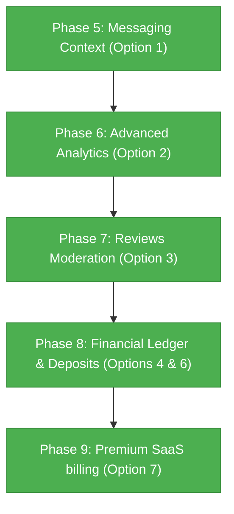

# Sellio Workspace - Active Implementation Roadmap

This report has been updated to track the next advanced functional phases of the **Sellio** monorepo workspace. All previous core integration phases (Phases 1 through 9) have been successfully completed, tested, and verified with zero compilation warnings.

---

## 🗺️ Next-Gen Milestone Execution Sequence

Below is the recommended sequence of development for the newly completed roadmap phases, demonstrating perfect integration across all core systems:

---

## 🟢 Phase 5: Premium Messaging & Inquiry Center (Option 1)
*Eager-loads and binds listing context directly into buyer-seller chat sessions.*

- [x] **Eager-Load Listing Relationships**: Update Laravel message/inquiry serialization to include polymorphic details of the referenced Property, Event, Job, Auto, Product, Service, or Classified listing.
- [x] **Contextual Sidebar Widget**: Build a premium glassmorphic sidebar inside `apps/seller/src/pages/messages/` displaying the key listing specifications (price, main image, location, and metadata tags) next to the active chat screen.
- [x] **Quick Action Redirections**: Provide inline deep-linking to allow sellers to navigate directly to the listing preview or editing pane from the messaging panel.

---

## 🔵 Phase 6: Unified Seller Analytics Dashboard (Option 2)
*Transforms basic visitor logs into highly actionable, aggregated performance widgets.*

- [x] **Cross-Vertical Metrics Aggregator**: Implement optimized API endpoints in Laravel that compile and cache traffic, lead conversion rates, and sales volumes across all listing verticals.
- [x] **Glassmorphic Charts & Data Widgets**: Replace static overview charts with dynamic SVG or Recharts visual representations in `DashboardHome.tsx` and the `analytics/` folder.
- [x] **Brand and Category Breakdowns**: Enable toggling statistics by specific categories, dates, and active listing brands.

---

## 🟠 Phase 7: Review & Testimonials Moderation Center (Option 3)
*Activates the polymorphic review engine across products, services, properties, and events.*

- [x] **Reviews Lifecycle API**: Construct API endpoints supporting replies to customer feedback and toggling public feature/visibility flags.
- [x] **High-Fidelity Review Manager**: Build a premium card-based layout under `/dashboard/reviews` featuring star ratings, filtering by vertical, and instant inline response inputs.
- [x] **Public Testimonial Embeds**: Create a front-facing widget to highlight approved testimonials directly on the partner's storefront homepage.

---

## 🟢 Phase 8: Wallet Transaction Ledger & Deposits (Options 4 & 6)
*Provides absolute financial bookkeeping, detailed payouts, and live deposit gateways.*

- [x] **Dynamic Transaction Ledger**: Replace static rows inside the Wallet with dynamic tables fetched from `TransactionLine` backend tables mapping sales, booking fees, and service quotes.
- [x] **Interactive Deposit Gateway**: Connect the "+ Add Funds" trigger inside `WalletPage.tsx` to an elegant glassmorphic modal accepting secure mock or live credit card credentials.
- [x] **Real-Time Credit Logic**: Program secure POST balance credits that immediately update the seller wallet balance and write complete audit ledger trails without hard page reloads.

---

## 🔴 Phase 9: Premium Subscriptions & Stripe Cashier SaaS Billing (Option 7)
*Migrates subscription management to fully automated recurring credit card checkouts and webhook suspension guards.*

- [x] **Laravel Cashier Setup**: Configure Laravel Cashier (Stripe) for standard plan definitions, customer records, and checkout session token generation.
- [x] **Live Quota Suspensions**: Integrate strict middleware checks that automatically lock creation buttons or degrade listing visibility when webhook subscription cancelations (`customer.subscription.deleted`) occur.
- [x] **Invoicing History Ledger**: Render a billing ledger in `/dashboard/memberships` showing transaction history and PDF receipt download links.
