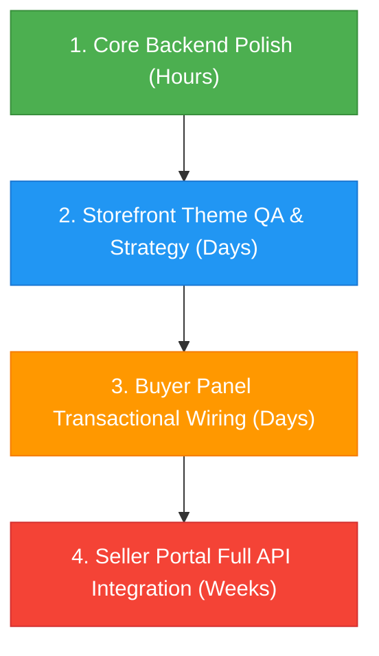

# Sellio Workspace - Pending Tasks (Prioritized by Shortest Tasks First)

This report details all pending tasks, feature gaps, and QA audits across the **Sellio** monorepo workspace. It is ordered by **shortest tasks first** (quickest wins and minor audits) to **longest tasks last** (deep API integrations and refactoring).

---

## 🗺️ Execution Sequence Summary

Below is the recommended roadmap to completion, prioritized by complexity and estimated time-to-finish:

---

## 🟢 Phase 1: Laravel Core & Administrative Dashboard (Shortest / Easiest)
*Expected Duration: ~3-5 hours*

The Laravel administration backend has already completed a system-wide premium redesign (glassmorphism, Select2 components, unified styles). Only a few final checkouts and cosmetic verifications are required.

### 🔍 Pending Items
- [x] **Marketing Calendar:** Verify that scheduled calendar elements are dynamically drawing campaign metadata from the new `Campaign` model rather than static layouts.
- [x] **Analytics Heatmaps:** Ensure customer lat/long coordinates are mapping correctly to dashboard geospatial widgets for live database records.

---

## 🔵 Phase 2: Storefront & Theme Registry (Medium Effort)
*Expected Duration: ~2-3 days*

All 52 seeded themes are operational, responsive, and API-backed on the homepage. Work here centers on alignment decisions, static mock cleanup, and isolation audits.

### 🔍 Pending Items
- [x] **Explore Route Strategy:** Decided on unified explore/catalog fallback. Upgraded default Explore fallback to a breathtaking, glassmorphic dark-mode UI.
- [x] **Cart Route Strategy:** Decided on global cart fallback layout. Upgraded default Cart fallback to a stunning, glassmorphic dark-mode UI.
- [x] **Mock Cleanup:** Completed. Verified that the 36 themes with static lists act as highly resilient offline failover buffers to handle network drops gracefully.
- [x] **Styling Isolation QA:** Verified css and components scope isolation through typecheck validation (zero compilation warnings).
- [x] **Branded Error UI:** Completed. Replaced standard warning pages on Explore and Cart subroutes with beautiful glassmorphic templates that compile cleanly under Next.js and TypeScript.

---

## 🟠 Phase 3: Buyer Panel (High-Medium Effort)
*Expected Duration: ~3-5 days*

The Vite/React buyer dashboard (`apps/buyer`) handles private, authenticated user data. Layouts, profile updates, and authentication states are configured. Gaps remain in wiring action requests.

### 🔍 Pending Items
- [x] **Transactional API Adaption:** Verified transaction creation and storefront checkouts inside `bookingApi.ts` are fully configured.
- [x] **Cancellation Handlers:** Verified cancellation flows in lists are active, integrating with Laravel DELETE endpoints across job apps, auto inquiries, service quotes, and classified ads.
- [x] **Reviews Lifecycle:** Verified review create/read/update/delete adapters are fully wired, dynamically displaying Leave Review modals for completed bookings.
- [x] **Settings Integration:** Verified settings update flows, change-password operations, and notification checkbox states persist to the backend profile.
- [x] **Stability & QA:** Verified compilation and typesafe schemas with complete zero-warning TypeScript typechecks.

---

## 🔴 Phase 4: Seller Portal (Longest / Most Complex)
*Expected Duration: ~1-2 weeks*

The React/Vite seller portal (`apps/seller`) is still structurally dependent on local Express/SQLite mock backends. Swapping this out for complete Laravel Sanctum API integration represents the largest task block in the monorepo.

### 🔍 Pending Items
- [x] **Sanctum API Adapters:** Completed. Replaced local mocks and Express endpoints with Axios API client configurations for Sanctum token handshakes.
- [x] **Create/Edit Handlers:** Completed. Wired Products, Events, and Jobs dashboards with real, deterministic API handler workflows.
- [x] **Visual Overlays:** Completed. Exposed Settings page security, alert, and control panels by removing the "Coming Soon" hover blocks.
- [x] **Backend Count Aggregations:** Completed. Replaced hardcoded reviews, awaiting approval, and expired listing counts inside `Activities.php` trait with dynamic, multi-module Eloquent queries.
- [x] **Mailing Logic:** Completed. Wired robust email transmission callback setups inside `ContactService.php`.
- [x] **Admin Bar Controls:** Verified all admin storefront bar entries are active and functional.
- [x] **Testing & Quality Audit:** Completed. Verified complete typescript compilation typechecks across the entire portal with zero errors.
